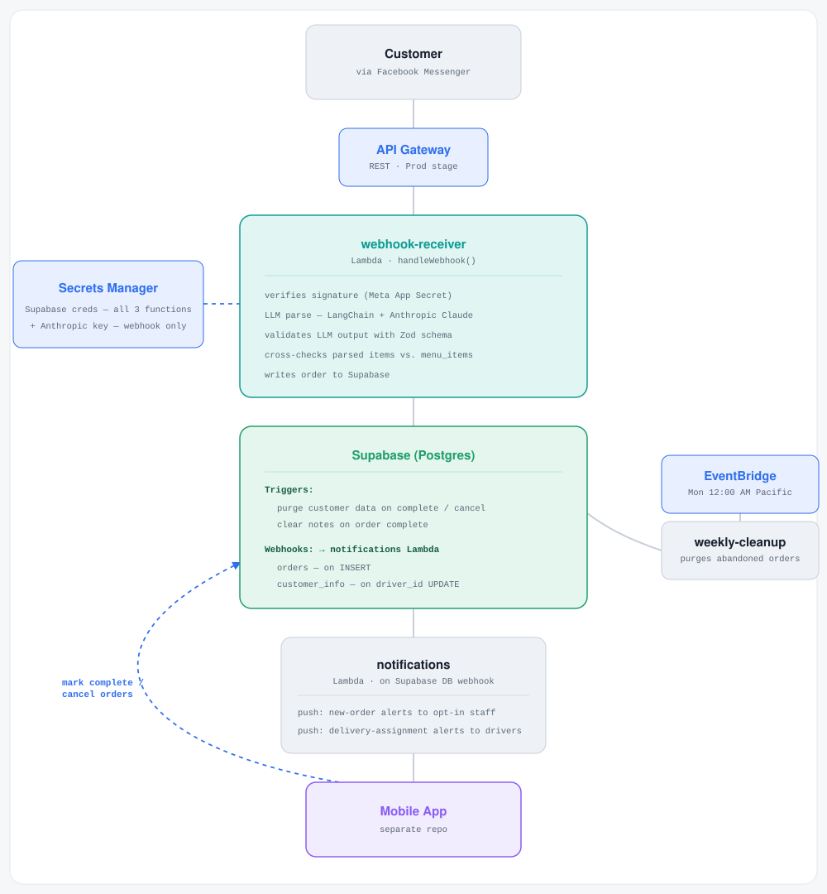
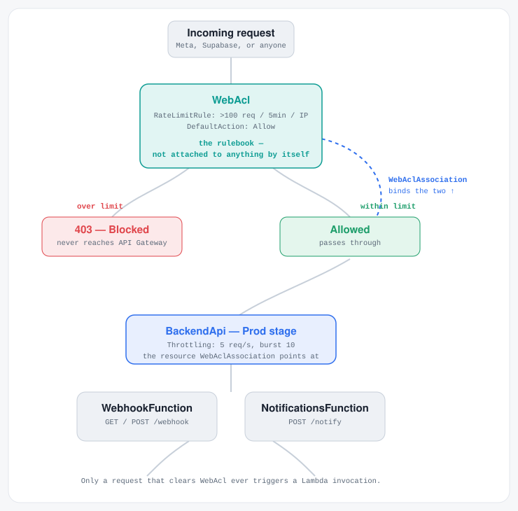

# Carnitas Order Manager: Backend


An AWS Lambda backend that receives customer orders sent through Facebook Messenger, uses an LLM to parse free-form conversation into structured order data, and coordinates order and delivery notifications for restaurant staff and drivers — built for a small, weekends-only family restaurant operation.

## Overview

Customers place orders by messaging the restaurant's Facebook Page. Rather than requiring a rigid order form, the backend reads the natural-language conversation and uses an LLM to extract structured order details — items, quantities, special instructions, and delivery information — which are then validated and written to the database for staff and drivers to act on through the companion mobile app.

The system is built with privacy as a first-class concern: customer contact information and conversation history are automatically deleted the moment an order is completed or canceled, and any order that's abandoned mid-conversation is swept up and deleted on a weekly schedule. No customer data is retained beyond what's needed to fulfill an active order.

## Architecture

### Backend

<picture>
  <source media="(prefers-color-scheme: dark)" srcset="diagrams/architecture-diagram-dark.svg">
  
</picture>

The backend consists of three AWS Lambda functions, deployed via AWS SAM and built with esbuild:

- **`webhook-receiver`** — Receives incoming Messenger webhook events from Meta and verifies the signature header with the Meta App Secret, uses an LLM (via LangChain, backed by Anthropic's Claude) to parse the conversation into a structured order, validates the LLM output against a Zod schema, cross-checks parsed items against `menu_items`, and writes the order to the database.
- **`notifications`** — Triggered by a Supabase Database Webhook (not client-side) on a new order INSERT or a `driver_id` UPDATE on `customer_info`. Sends new-order push alerts to opt-in staff, and delivery-assignment push alerts to drivers (mandatory, not opt-in).
- **`weekly-cleanup`** — Runs on a schedule (EventBridge Scheduler, every Monday at 12:00 AM Pacific) to delete any order that was started but never completed or canceled, along with all associated customer data.

Each function maintains its own `lib/` with a Supabase client and connects using a service-role key, since the backend is a trusted process with no end-user session.

### WAF — Rate Limiting

<picture>
  <source media="(prefers-color-scheme: dark)" srcset="diagrams/waf-diagram-dark.svg">
  
</picture>

`AWS::WAFv2::WebACL` and `AWS::WAFv2::WebACLAssociation` are two separate CloudFormation resources with two separate jobs: the `WebAcl` defines the rules (a rate limit of >100 requests per 5 minutes per IP, default-allow otherwise), while the `WebAclAssociation` is what actually switches those rules on for the API Gateway stage.

## Data Privacy & Retention

This system is designed to retain customer data for as little time as possible:

- When an order is marked complete or canceled, a database trigger automatically and permanently deletes the associated customer contact information, conversation history, and messages.
- Any order that never reaches completion or cancellation (ex. an abandoned conversation) is deleted automatically every week, along with any associated customer data.
- Only non-identifying order records (items and completion status) are retained, for internal tracking such as counting completed orders. Special-instruction notes on these retained records are cleared at the moment of completion, independent of the rest of the deletion logic.

## Tech Stack

- **Runtime:** Node.js 20.x, TypeScript
- **Infrastructure:** AWS SAM (CloudFormation), AWS Lambda, API Gateway, EventBridge Scheduler
- **Secrets:** AWS Secrets Manager
- **LLM pipeline:** LangChain + Anthropic Claude, with Zod schema validation
- **Database:** Supabase (Postgres), with Row Level Security and SECURITY DEFINER triggers for cascading deletion
- **Build:** esbuild
- **CI/CD:** GitHub Actions (OIDC-based deploy on merge to `main`)

## Project Structure

```
.
├── webhook-receiver/     # Messenger webhook intake + LLM order parsing
│   └── lib/              # Supabase client
├── notifications/        # Push notification dispatch
│   └── lib/              # Supabase client
├── weekly-cleanup/       # Scheduled cleanup of abandoned orders
│   └── lib/              # Supabase client
└── template.yaml         # SAM infrastructure definition
```

## Getting Started

### Prerequisites

- Node.js 20.x
- AWS CLI, configured with appropriate credentials
- AWS SAM CLI
- A Supabase project, with the required tables, RLS policies, and triggers set up (schema is managed directly via SQL in the Supabase dashboard — not version-controlled in this repo)

### Installation

Each function manages its own dependencies independently:

```bash
cd webhook-receiver && npm install
cd ../notifications && npm install
cd ../weekly-cleanup && npm install
```

### Local Development

```bash
sam build
sam local invoke <FunctionName> --event events/<event-file>.json
```

## Deployment

Deployment runs automatically via GitHub Actions on merge to `main`. To deploy manually:

```bash
sam build
sam deploy
```

## License

Distributed under the MIT License. See `LICENSE` for details.

## Contact

Ricardo Vazquez - [ricardo.vazquez2001@gmail.com](mailto:ricardo.vazquez2001@gmail.com)
